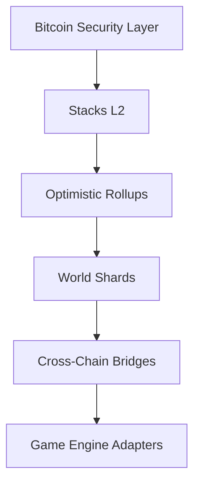

# NexusVerse Protocol - Smart Contract Documentation

## Table of Contents

1. [Protocol Overview](#protocol-overview)
2. [Key Features](#key-features)
3. [Technical Architecture](#technical-architecture)
4. [Smart Contract Components](#smart-contract-components)
5. [Core Functions](#core-functions)
6. [Error Handling](#error-handling)
7. [Deployment & Usage](#deployment--usage)
8. [Security Considerations](#security-considerations)
9. [Dependencies](#dependencies)

## Protocol Overview <a name="protocol-overview"></a>

NexusVerse is an enterprise-grade gaming protocol enabling:

- Cross-chain asset interoperability
- Persistent player identities
- Sharded world state management
- Merit-based reward systems
- Bitcoin-secured transactions via Stacks L2

## Key Features <a name="key-features"></a>

### 1. Cross-Chain Asset Engine

- Universal NFT standard with upgradable attributes
- Multi-game asset portability
- Atomic cross-chain swaps

### 2. Persistent Identity System

- Biometrically-secured avatars
- Skill-based progression algorithms
- Cross-metaverse reputation system

### 3. World Orchestration Layer

- Dynamic difficulty adjustment
- Player-driven world evolution
- Massively concurrent gameplay support

### 4. Meritocratic Economy

- Sybil-resistant rewards
- ELO-based ranking systems
- Fraud-proof leaderboards

## Technical Architecture <a name="technical-architecture"></a>



## Smart Contract Components <a name="smart-contract-components"></a>

### 1. Digital Assets

```clarity
(define-non-fungible-token nexus-asset uint)
(define-map nexus-asset-metadata
  { token-id: uint }
  {
    name: (string-ascii 50),
    power-level: uint,
    world-id: uint,
    attributes: (list 10 (string-ascii 20)),
    experience: uint,
    level: uint
  }
)
```

### 2. Player Avatars

```clarity
(define-map avatar-metadata
  { avatar-id: uint }
  {
    level: uint,
    experience: uint,
    achievements: (list 20 (string-ascii 50)),
    equipped-assets: (list 5 uint),
    world-access: (list 10 uint)
  })
```

### 3. Virtual Worlds

```clarity
(define-map game-worlds
  { world-id: uint }
  {
    entry-requirement: uint,
    active-players: uint,
    total-rewards: uint
  }
)
```

### 4. Competitive Leaderboard

```clarity
(define-map leaderboard
  { player: principal }
  {
    score: uint,
    games-played: uint,
    total-rewards: uint,
    avatar-id: uint,
    rank: uint
  }
)
```

## Core Functions <a name="core-functions"></a>

### Asset Management

| Function              | Parameters                                                     | Description                                        |
| --------------------- | -------------------------------------------------------------- | -------------------------------------------------- |
| `mint-nexus-asset`    | (name, description, rarity, power-level, world-id, attributes) | Creates new cross-game NFT asset                   |
| `transfer-game-asset` | (token-id, recipient)                                          | Secures asset transfer with ownership verification |

### Avatar System

```clarity
(define-public (create-avatar
    (name (string-ascii 50))
    (world-access (list 10 uint))
  )
  ;; Creates persistent player identity with world access rights
)
```

### World Management

```clarity
(define-public (create-game-world
    (name (string-ascii 50))
    (description (string-ascii 200))
    (entry-requirement uint)
  )
  ;; Instantiates new game world with entry requirements
)
```

### Competitive Play

```clarity
(define-public (update-player-score
  (player principal)
  (new-score uint)
)
  ;; Updates ELO-style ranking with anti-cheat checks
```

## Error Handling <a name="error-handling"></a>

| Error Code                     | Description                       |
| ------------------------------ | --------------------------------- |
| ERR-NOT-AUTHORIZED (u1)        | Unauthorized admin access attempt |
| ERR-INVALID-GAME-ASSET (u2)    | Invalid NFT asset operation       |
| ERR-MAX-LEVEL-REACHED (u22)    | Avatar level cap enforcement      |
| ERR-INVALID-WORLD-ACCESS (u20) | World entry requirements not met  |

Full error list available in [Error Constants](#error-constants) section.

## Deployment & Usage <a name="deployment--usage"></a>

### Requirements

- Clarinet 1.0+
- Stacks 2.1 node
- Bitcoin testnet environment

### Installation

```bash
git clone https://github.com/nexusverse/core-contracts
clarinet console
```

### Example Usage

1. **Mint Game Asset**

```clarity
(contract-call? .nexusverse-contract mint-nexus-asset
  "Dragon Sword"
  "Legendary weapon"
  "legendary"
  950
  1
  (list "fire" "magic")
)
```

2. **Create Player Avatar**

```clarity
(contract-call? .nexusverse-contract create-avatar
  "PlayerOne"
  (list 1 2 3)
)
```

## Security Considerations <a name="security-considerations"></a>

- All transactions finalized on Bitcoin blockchain
- MPC-based cross-chain bridges
- Zero-knowledge reputation proofs
- Fraud-resistant oracle network

## Dependencies <a name="dependencies"></a>

- Stacks L2 (PoX consensus)
- Bitcoin transaction finality
- Chainlink Oracles (for cross-chain verification)
